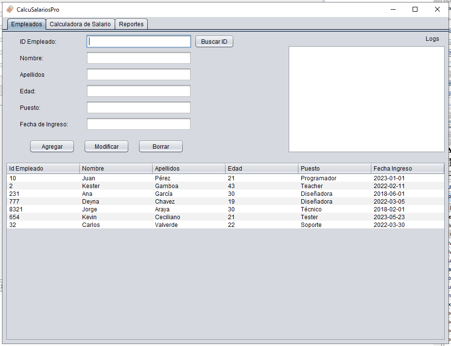
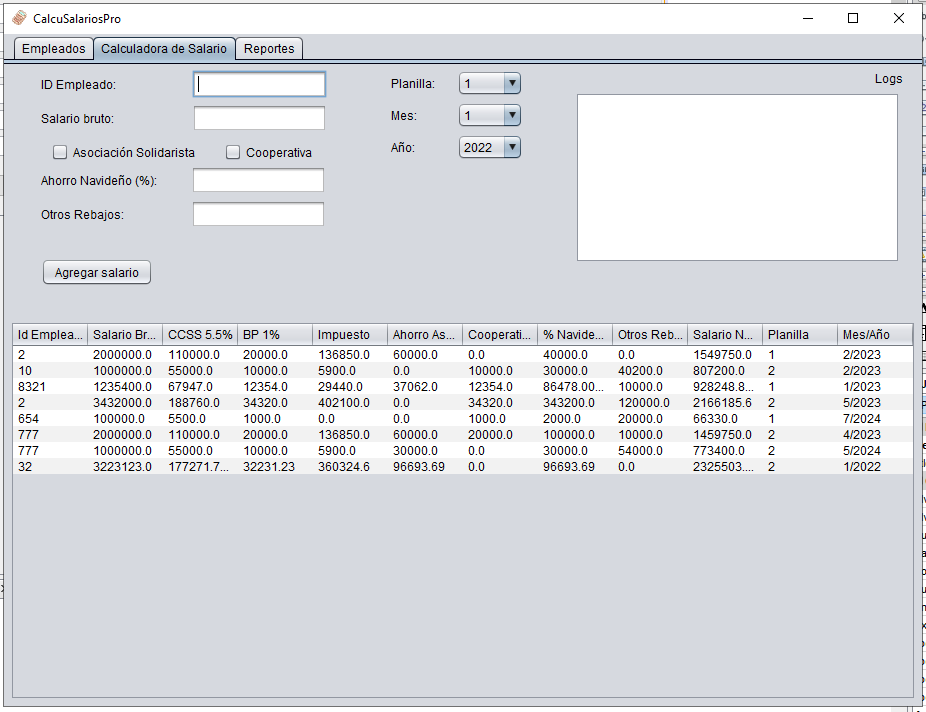
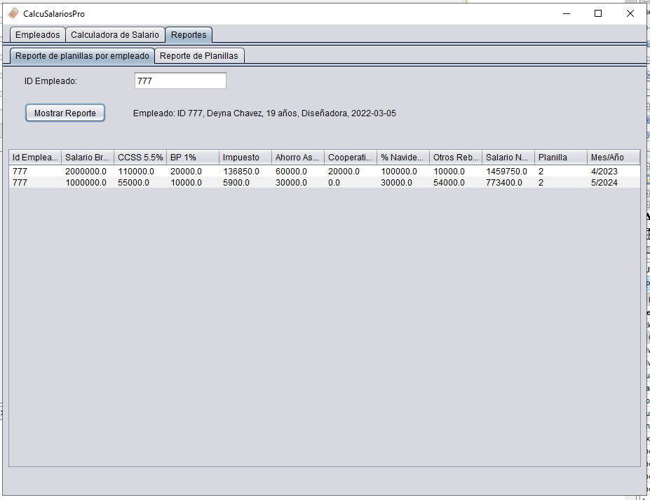

# Calculadora de Salarios

00824 - PROGRAMACION INTERMEDIA - IC2023
Cátedra Tecnología de Sistemas / Informática UNED CR

En este repositorio se sube el proyecto realizado para este curso. En este curso se trabaja en Java con el IDE NetBeans 8.2

Para la GUI se utilizó Java Swing en este proyecto con ayuda de la herramienta de Design de NetBeans.

## Screenshots
Ventana en donde se modifican los empleados

Ventana en donde se calculan los salarios

Ventana de generación de reportes

